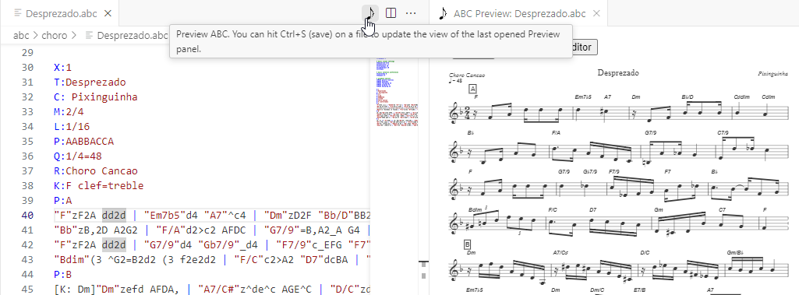
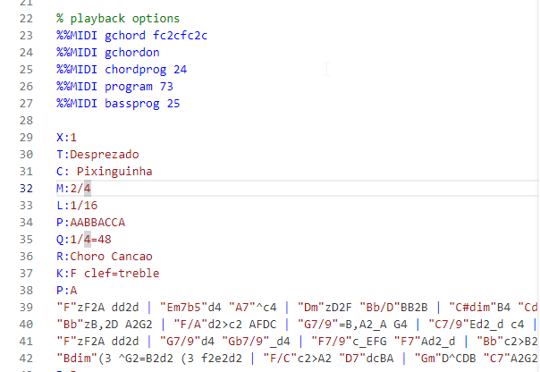
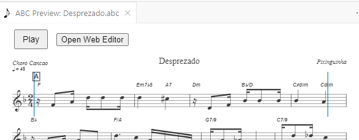

# vscode-abc-music-editor
A VS Code extension to add support to ABC Music notation using abc2svg.

## Features

### 🎼 Instant ABC Music Notation Preview  
  Preview your ABC music files as beautiful sheet music directly in VS Code with a single click on the note icon.
  

### ⚡ Live Updates  
  The preview panel updates automatically when you make changes to your `.abc` file, so you can see changes in real time.

### 📝 Syntax Highlighting
  Enjoy clear, colorful syntax highlighting for ABC notation, making your `.abc` files easier to read and edit.

### ▶️ Play Your Tunes  
  Listen to your ABC music directly in VS Code with integrated playback—perfect for quickly checking your compositions.

### 🔍 Selection-Based Playback  
  Play only the selected portion of your ABC file. To select, click on a note and drag in direction to another note.

### 🗂️ Store your frequently-used ABC directives in separate files
  Support through [abctools](https://github.com/laurent-yin/abctools) of .abcconfig files, to store your %%directives in a common place for each folder.
  
  See [choro-abc](https://github.com/laurent-yin/choro-abc) for a real-world example of a repository that uses abctools to manage and export ABC music notation files.

### 📦 Integrated with abc2svg
  Leverages the power of abc2svg library for accurate rendering and advanced ABC features.